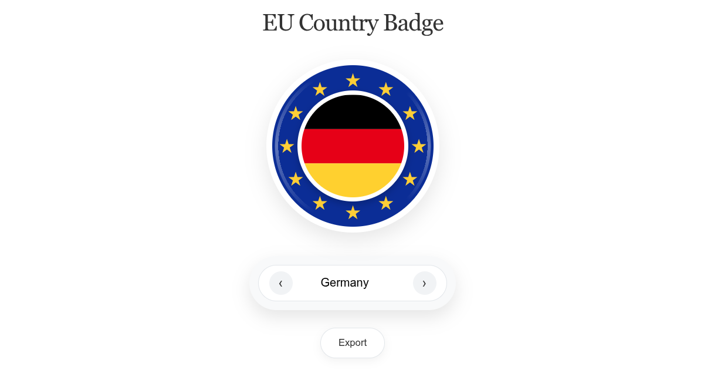

# Country Badges EU

Making "Buy European" easy and recognizable.

## Purpose
This project provides a unified icon set to help show European identity and product origin. The design features the European Union flag surrounded by a border of specific national colors, making the origin instantly recognizable at a glance.

The project includes flags for all European Union member states and all Council of Europe member states.

These icons are intended for use on shops, websites, and packaging to help consumers support local and European products.

## Live Demo
Visit the main page at: [https://country-badges.eu/](https://country-badges.eu/)

## Origin
The idea originated from a [proposal on Reddit](https://www.reddit.com/r/BuyFromEU/comments/1qmhd4g/comment/o1n49l6/?context=3) to improve how we market European origin:
> Supporting local and buying European is great, but let’s be honest: it’s often a struggle to find where products actually come from. Why don't we market our origin better?

## Credits
Flag assets were sourced from [Flagpedia.net](https://flagpedia.net/).

## License
This project is licensed under the [MIT License](LICENSE).
